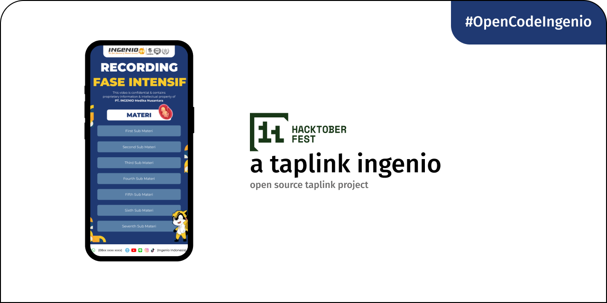

# taplink-ingenio
Hello awesome contributors!

We're excited to have you join us in making the Taplink Ingenio Project even better this Hacktoberfest! Whether you're a seasoned open-source pro or new to the world of coding, your contributions are incredibly valuable and appreciated.

### Overview
The goal of this challenge is to take a Figma design and translate it into fully functional, responsive components using Next.js. This is a great opportunity to work with modern web technologies while contributing to an open-source project.

### Objective
Participants will be responsible for: converting sections from a Figma design into reusable Next.js components, Esuring that the components are responsive and follow the best CSS/SCSS practices, Maintaining consistency with the design, paying close attention to details like padding, margin, fonts, colors, and other UI/UX elements.

### Prerequisites
To participate in this challenge, you should have: familiarity with Next.js (React framework), knowledge of HTML, CSS/SCSS, and basic JavaScript, some experience with Figma or the ability to interpret design files.

### Steps to Participate
Get Started with the [Figma Design](https://www.figma.com/design/n8z3TSyGk9qiGt8Rr6wDCh/fasiningenio-nextjs-frontend-taplink?node-id=0-1&t=y43DKBlJuLlwsxwR-1), continue with this next section.

### How to Get Involved?

#### Find an Issue:
Check out our repository for good first issues and open bugs. We have something for everyone!

#### Create a Pull Request:
Once you've found something you'd like to work on, fork the repo, make your changes, and submit a pull request.

#### Collaborate:
Don’t hesitate to ask questions, discuss ideas, or ask for help. We believe in teamwork and making open-source a fun experience for all.

#### Contribution Guidelines:
Make sure your pull requests align with our contribution guidelines.
All levels of contributions are welcome: code, documentation, and even just reporting bugs or proposing new features!

### Why Contribute?
Make meaningful contributions to a growing project.
Be part of the global Hacktoberfest celebration.
Learn, collaborate, and connect with developers from around the world.
Let’s build something great together this Hacktoberfest! Happy coding, and thank you for being part of the Taplink Ingenio Project!

### Contributors
- [@rasvanjaya21](https://github.com/ingenio-indonesia/taplink-ingenio/pull/2) - title component
